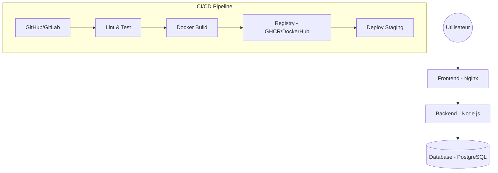

# VitalSync - Système de Suivi Médical et Sportif

## Description
VitalSync est une application moderne de suivi médical et sportif. Ce dépôt contient l'infrastructure DevOps complète, incluant la conteneurisation, la pipeline CI/CD et les manifestes d'orchestration Kubernetes.

## Architecture
L'architecture repose sur trois composants principaux :
1.  **Frontend** : Application React servie par Nginx.
2.  **Backend** : API REST Node.js/Express.
3.  **Database** : Base de données PostgreSQL.



## Prérequis
- Docker & Docker Compose
- Git
- Node.js (v20+)

## Installation et Lancement Local
Pour lancer l'application localement avec Docker Compose :

```bash
# 1. Cloner le dépôt
git clone https://github.com/nabilsaied15/vitalsync_projet-.git
cd vitalsync_projet

# 2. Créer le fichier .env
cp .env.example .env

# 3. Lancer les services
docker-compose up --build
```

L'application sera accessible sur `http://localhost`.

## Pipeline CI/CD
La pipeline est configurée via **GitHub Actions** (`.github/workflows/main.yml`) et comprend les étapes suivantes :
1.  **Lint & Tests** : Vérification de la qualité du code et exécution des tests unitaires Jest.
2.  **Docker Build & Push** : Construction des images Docker taguées avec le SHA du commit et push vers le registre.
3.  **Déploiement Staging** : Simulation du déploiement avec vérification de l'endpoint `/health`.

## Choix Techniques
- **Multi-stage Build Docker** : Réduction de la taille de l'image finale et meilleure sécurité.
- **Nginx Proxy** : Gestion simple des requêtes API sans configuration CORS complexe.
- **Kubernetes** : Utilisation de Deployments avec 2 réplicas pour la haute disponibilité et de Liveness Probes pour l'auto-réparation.
